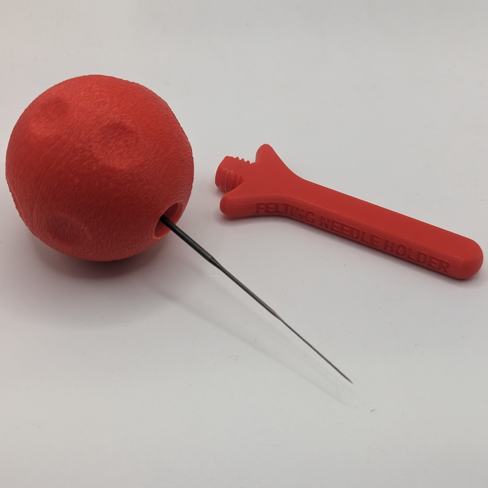

<!---  Open Source Assistive Technology: GitHub Readme Template Version 1.1 (2024-Mar-15)  --->

<!---  TITLE  --->
# Felting Needle Holder

<!---  SUMMARY  --->
The Felting Needle Holder is an open assistive technology device intended to make it easier to hold and manipulate a felting needle. The holder is ball-shaped with a diameter of 50 mm, and is comprised of four 3D printed parts. This aid is designed to be used with a felting needle that has a metal shaft with a bent end (e.g., [DIMENSIONS Replacement Felting Needles 72-73664](https://www.amazon.ca/Dimensions-Needlecrafts-Feltworks-Replacement-Felting/dp/B004W8TGIS)).

The holder consists of several 3D printed parts. No additional hardware is required. The overall cost of materials is about $1.

The Felting Needle Holder is an open assistive technology (OpenAT). Under the terms of the open source licenses, the device may be built, used, and improved upon by anyone.

Last Updated: 2024-May-16
The latest version (1.0) now includes a cover for the needle and labels to help indicate the direction to spin the ball to open or close it. The previous version (0.2) was built and tested by at least one user.

## More info at
- [Makers Making Change Assistive Device Library Listing](https://www.makersmakingchange.com/s/product/felting-needle-holder/01tJR000004E3gVYAS)

## How to Obtain the Device
### 1. Do-it-Yourself (DIY) or Do-it-Together (DIT)

This is an open-source assistive technology, so anyone is free to build it. All of the files and instructions required to build the device are contained within this repository. Refer to the Maker Guide below.

### 2. Request a build of this device

You may also submit a build request through the [Makers Making Change Assistive Device Library Listing](https://www.makersmakingchange.com/s/product/felting-needle-holder/01tJR000004E3gVYAS) to have a volunteer maker build the device. As the requestor, you are responsible for reimbursing the maker for the cost of materials and any shipping.

### 3. Build this device for someone else

If you have the skills and equipment to build this device, and would like to donate your time to create the device for someone who needs it, visit the [MMC Maker Wanted](https://makersmakingchange.com/maker-wanted/) section.

## Build Instructions

### 1. Read through the Maker Guide

The [Maker Guide](/Documentation/Felting_Needle_Holder_Maker_Guide.pdf)  contains all the necessary information to build this device, including tool lists, assembly instructions, and testing.

### 2. Order the Off-The-Shelf Components

The [Bill of Materials](/Documentation/Felting_Needle_Holder_BOM.xlsx) lists all of the parts and components required to build the device.

### 3. Print the 3D Printable components

All of the files and individual print files can be in the [/Build_Files/3D_Printing_Files](/Build_Files/3D_Printing_Files/) folder.

### 4. Assemble the Felting Needle Holder

Reference the Assembly Guide section of the [Maker Guide](/Documentation/Felting_Needle_Holder_Maker_Guide.pdf) for the tools and steps required to build each portion.

## How to improve this Device
As open source assistive technology, you are welcomed and encouraged to improve upon the design. 

## Files
### Documentation
| Document             | Version | Link |
|----------------------|---------|------|
| Design Rationale     | 1.0     | [Felting_Needle_Holder_Design_Rationale](/Documentation/Felting_Needle_Holder_Design_Rationale.pdf)     |
| Maker Guide          | 1.0     | [Felting_Needle_Holder_Maker_Checklist](/Documentation/Felting_Needle_Holder_Maker_Guide.pdf)     |
| Bill of Materials    | 1.0     | [Felting_Needle_Holder_Bill_of_Materials](/Documentation/Felting_Needle_Holder_BOM.xlsx)     |
| User Guide           | 1.0     | [Felting_Needle_Holder_User_Guide](/Documentation/Felting_Needle_Holder_User_Guide.pdf)    |
| Changelog            | 1.0     | [Changelog](CHANGES.txt)     |

### Design Files
<!--- DESIGN FILES --->
 - [CAD Files](/Design_Files/CAD_Design_Files)

<!--- BUILD FILES --->
### Build Files
 - [3D Printing Files](/Build_Files/3D_Printing_Files)

<!--- ATTRIBUTION --->
## Attribution

This device was designed by the Neil Squire Society / Makers Making Change.

<!--- This is the attribution for the template. --->
The documentation template was created by Makers Making Change / Neil Squire Society and is used under a CC BY-SA 4.0 license. It is available at the following link: [https://github.com/makersmakingchange/OpenAT-Template](https://github.com/makersmakingchange/OpenAT-Template)

<!--- CONTRIBUTORS --->
### Contributors

 - Zee Kesler. Initial idea and design challenge.
 - Jake McIvor, Neil Squire Society. Design and documentation.

<!--- LICENSE Add the year(s) for the copyright and the Designer Name. You may use the standard set of open licenses or choose your own for the hardware, software, and accompanying materials. --->
## License
Copyright (c) 2022-2024 Neil Squire Society.

This repository describes Open Hardware:
 - Everything needed or used to design, make, test, or prepare the Felting Needle Holder is licensed under the [CERN 2.0 Weakly Reciprocal license (CERN-OHL-W v2) or later](https://cern.ch/cern-ohl ) .
 - Accompanying material such as instruction manuals, videos, and other copyrightable works that are useful but not necessary to design, make, test, or prepare the Felting Needle Holder are published under a [Creative Commons Attribution-ShareAlike 4.0 license (CC BY-SA 4.0)](https://creativecommons.org/licenses/by-sa/4.0/) .

You may redistribute and modify this documentation and make products using it under the terms of the [CERN-OHL-W v2](https://cern.ch/cern-ohl).
This documentation is distributed WITHOUT ANY EXPRESS OR IMPLIED WARRANTY, INCLUDING OF MERCHANTABILITY, SATISFACTORY QUALITY AND FITNESS FOR A PARTICULAR PURPOSE.
Please see the CERN-OHL-W v2 for applicable conditions.

Source Location: https://github.com/makersmakingchange/Felting-Needle-Holder

---

<!-- ABOUT MMC START -->
## About Makers Making Change

Makers Making Change is a program of [Neil Squire](https://www.neilsquire.ca/), a Canadian non-profit that uses technology, knowledge, and passion to empower people with disabilities.

Makers Making Change leverages the capacity of community based Makers, Disability Professionals and Volunteers to develop and deliver affordable Open Source Assistive Technologies.

 - Website: [www.MakersMakingChange.com](https://www.makersmakingchange.com/)
 - GitHub: [makersmakingchange](https://github.com/makersmakingchange)
 - Bluesky: [@makersmakingchange.bsky.social](https://bsky.app/profile/makersmakingchange.bsky.social)
 - Instagram: [@makersmakingchange](https://www.instagram.com/makersmakingchange)
 - Facebook: [makersmakechange](https://www.facebook.com/makersmakechange)
 - LinkedIn: [Neil Squire Society](https://www.linkedin.com/company/neil-squire-society/)
 - Thingiverse: [makersmakingchange](https://www.thingiverse.com/makersmakingchange/about)
 - Printables: [MakersMakingChange](https://www.printables.com/@MakersMakingChange)

### Contact Us
For technical questions, to get involved, or to share your experience we encourage you to [visit our website](https://www.makersmakingchange.com/) or [contact us](https://www.makersmakingchange.com/s/contact).
<!-- ABOUT MMC END -->
